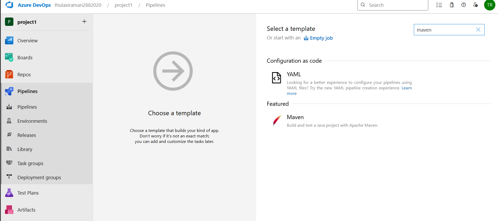
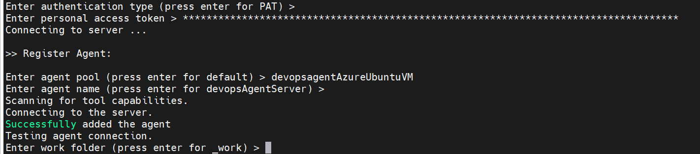
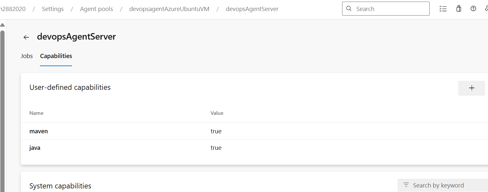
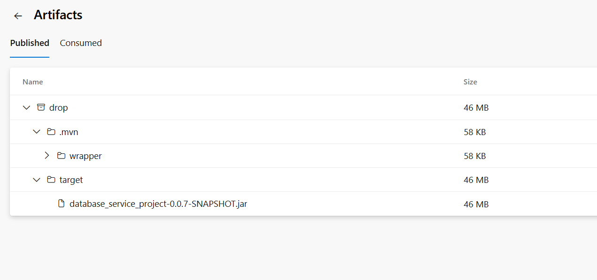
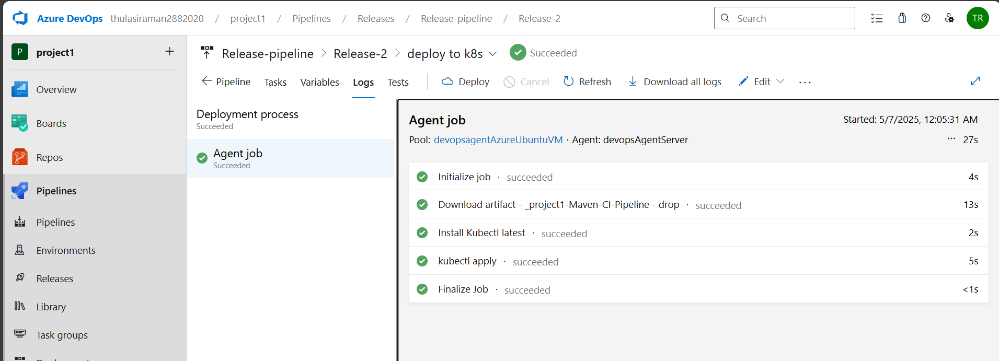

## Azure Devops CI/CD


# 🚀 Azure DevOps CI/CD Pipeline for Maven-based Java Application with SonarQube + Trivy Scan and deployment on to Azure Kubernetes Multi-Node Cluster

This project demonstrates a complete CI/CD setup using **Azure DevOps**, integrating:
- Self-hosted agent on Azure VM
- Maven build automation
- SonarQube for code quality
- Trivy for vulnerability scanning
- Docker for containerization
- AKS (Azure Kubernetes Service) for deployment

---

## workflow


## 📁 Project Structure

```bash
.
├── azure-pipelines.yml          # CI pipeline for build, test, scan, and Docker push
├── kubernetes-manifests/       # AKS deployment and service manifests
├── src/                        # Java application source code
└── README.md
```

---

## 🛠️ Tools & Technologies

| Tool           | Purpose                         |
|----------------|----------------------------------|
| Azure DevOps   | CI/CD orchestration              |
| Maven          | Build automation                 |
| SonarQube      | Code quality analysis            |
| Trivy          | Container vulnerability scanning |
| Docker         | Image creation & containerization|
| AKS            | Application deployment platform  |
| Azure VM (Linux)| Self-hosted agent infrastructure |

---

## 🧪 CI Pipeline Overview

### Trigger
- Runs on every push to `main` branch

### Tasks
1. **Checkout Code**
2. **Build with Maven**
3. **SonarQube Analysis**
4. **Trivy Security Scan**
5. **Docker Build & Push to Docker Hub**
6. **Publish Artifact for CD pipeline**

---

## 📦 Artifact

- Location: `$(Pipeline.Workspace)/drop`
- Contains built `.jar` and `Dockerfile`

---

## 🚚 CD Pipeline Overview

1. **Trigger**: When artifact is published by CI
2. **Tasks**:
   - Pull Docker image from registry
   - Deploy to AKS using kubectl and YAML manifests

---

## 🧰 Self-Hosted Agent Setup

### 1. Provision VM
- Create Ubuntu VM on Azure
- Allow SSH (port 22) and custom ports like 9000 (for SonarQube)

### 2. Install Required Packages
```bash
sudo apt update
sudo apt install openjdk-17-jre-headless maven docker.io
sudo snap install trivy
```

### 3. Configure Docker Permissions
```bash
sudo usermod -aG docker $USER
```

### 4. Download Azure DevOps Agent
```bash
# Download and extract the agent
wget https://vstsagentpackage.azureedge.net/agent/<version>/vsts-agent-linux-x64-<version>.tar.gz
tar -xzf vsts-agent-linux-x64-<version>.tar.gz
./config.sh
./run.sh
```

> Use your Azure DevOps organization URL and generate a Personal Access Token (PAT) to authenticate.

---

## 🔍 SonarQube Setup

### Run Container
```bash
docker run -d --name sonar -p 9000:9000 mc1arke/sonarqube-with-community-branch-plugin
```

### Access
- URL: `http://<VM_Public_IP>:9000`

---

## 🛡️ Trivy Security Scan

Used in CI pipeline to scan Docker image:
```yaml
- script: |
    trivy image mydockeruser/myapp:$(Build.BuildId)
```

---

## ☸️ AKS Deployment

### 1. Create Cluster
```bash
az aks create --resource-group <group> --name <cluster-name> --node-count 2 --generate-ssh-keys
az aks get-credentials --name <cluster-name> --resource-group <group>
```

### 2. Apply Manifests
```bash
kubectl apply -f kubernetes-manifests/
```

---

## 🧪 End-to-End Test

1. Make a commit to Git repo
2. CI pipeline triggers: build, scan, analyze, push
3. CD pipeline triggers: pulls image and deploys to AKS
4. Application accessible via Ingress/LoadBalancer

---

## 🧹 Cleanup

```bash
# Stop and remove agent
./svc.sh stop
./svc.sh uninstall
rm -rf _work _diag

# Remove resources
az devops project delete --id <project-id>
az vm delete --name <vm> --resource-group <group> --yes
az aks delete --name <cluster> --resource-group <group> --yes
```

---

## ✅ Result

- CI/CD fully automated using Azure DevOps
- Code quality checks via SonarQube
- Vulnerability scan via Trivy
- Docker container built and pushed
- Deployed to Azure Kubernetes Service
- Verified running application

---

## 📸 Screenshots

> Refer to the original document for images on:
- VM setup
- Agent configuration
- CI/CD run outputs
- SonarQube portal
- Trivy scan results
- AKS deployment verification

---


## Hands-on
 
# Project creation


# Import the repository


# pipelines

Classic Pipeline 
YAML / Declarative Pipeline


Wanted to create a MAVEN based project




##[error]No hosted parallelism has been purchased or granted. To request a free parallelism grant, please fill out the following form https://aka.ms/azpipelines-parallelism-request

because we dont have any agent machine to perform this pipeline task


hence, we can setup one VM


## create Azure vm


Use mobaXterm / remote desktop connection manager to connect to a vm

using public IP


in linux ( ubuntu) the package installation starts

`sudo apt update`


add the vm to our pipeline as agent

 - create the agent in the organization setting > pipeline > agent pool


execute the download cmdline in agent 


config.sh  - to make this VM as agent
run.sh  - to initialize and start the agent


add ur organization url

generate your personal access token



workfolder : 


agent is added but offline. so we are to start the agent service


agent is online Now

# --------------

# package installation in Agent server - Java, Maven, trivy, sonarqube
`sudo apt install openjdk-17-jre-headless`
`sudo apt install maven`
`sudo snap install trivy`
`sudo apt install docker.io`


# sonarqube - tool to perform code quality check and code coverage

source code > may have different issues, bugs, vulnerabilities...

in our project - we will use docker image ( free custom image with branch feature - code coverage )


provide docker access to the azureuser


`docker run -d --name sonar -p 9000:9000 mc1arke/sonarqube-with-community-branch-plugin`


check the container status


if you're unable to access the sonarqube portal

need to update the azure Network setting - nsg to allow port 9000 


we can also set some expectation for the agent to run about project task


like the agent should have java, maven, trivy, sonarqube




Start the agent service and test the basic pipeline function


atleast it is working


check the artifact 


# integrate sonarqube into pipeline using marketplace plugin / Extension


endpoint - our agent which runs the sonarqube container


cmd task to execute trivy scan


Run the CI pipeline and verify the result

 -  Maven test and Package status
 - artifact has been produced and dropped
 - sonar qube  project preparation and analysis
 - trivy scan completion
 - docker image creation and push to our registry


 
 
 


 


 Prepare the deployment environment - AKS

 cluster

 


 # Release Pipeline


 
 


 # End to End Test

 create a change in repo

 

 Test the CI trigger

 
 

 

 check the Continuous trigger on Release pipeline

 

 release is succeeded
 
 
 
 


 trivy report

 

 check if the pod is created in our AKS node

 

 2 pod replicas
 

 To access the application - service & Ingress

 

 Application is accessible and running fine

 


## destruction

Stop the agent
delete the pipeline
delete the repo
delete the PAT, secrets, service connections
delete the docker Hub repository
delete the Azure devops project
remove the agent pools
Clear up all your resources


